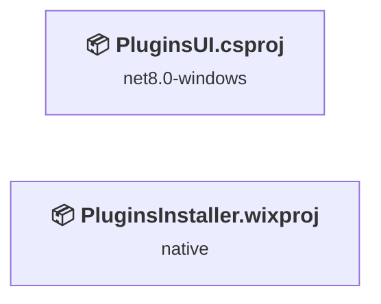
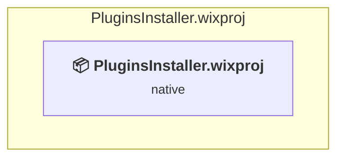
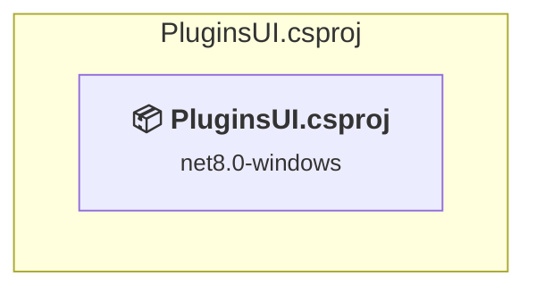

# Projects and dependencies analysis

This document provides a comprehensive overview of the projects and their dependencies in the context of upgrading to .NETCoreApp,Version=v10.0.

## Table of Contents

- [Executive Summary](#executive-Summary)
  - [Highlevel Metrics](#highlevel-metrics)
  - [Projects Compatibility](#projects-compatibility)
  - [Package Compatibility](#package-compatibility)
  - [API Compatibility](#api-compatibility)
  - [Binding Redirect Configuration](#binding-redirect-configuration)
- [Aggregate NuGet packages details](#aggregate-nuget-packages-details)
- [Top API Migration Challenges](#top-api-migration-challenges)
  - [Technologies and Features](#technologies-and-features)
  - [Most Frequent API Issues](#most-frequent-api-issues)
- [Projects Relationship Graph](#projects-relationship-graph)
- [Project Details](#project-details)

  - [PluginsInstaller\PluginsInstaller.wixproj](#pluginsinstallerpluginsinstallerwixproj)
  - [PluginsUI\PluginsUI.csproj](#pluginsuipluginsuicsproj)

## Executive Summary

### Highlevel Metrics

| Metric | Count | Status |
| :--- | :---: | :--- |
| Total Projects | 2 | All require upgrade |
| Total NuGet Packages | 2 | All compatible |
| Total Code Files | 10 |  |
| Total Code Files with Incidents | 8 |  |
| Total Lines of Code | 4602 |  |
| Total Number of Issues | 608 |  |
| Estimated LOC to modify | 606+ | at least 13.2% of codebase |

### Projects Compatibility

| Project | Target Framework | Difficulty | Package Issues | API Issues | Binding Issues | Est. LOC Impact | Description |
| :--- | :---: | :---: | :---: | :---: | :---: | :---: | :--- |
| [PluginsInstaller\PluginsInstaller.wixproj](#pluginsinstallerpluginsinstallerwixproj) | native | 🟢 Low | 0 | 0 | 0 |  | DotNetCoreApp, Sdk Style = True |
| [PluginsUI\PluginsUI.csproj](#pluginsuipluginsuicsproj) | net8.0-windows | 🟡 Medium | 0 | 606 | 0 | 606+ | Wpf, Sdk Style = True |

### Package Compatibility

| Status | Count | Percentage |
| :--- | :---: | :---: |
| ✅ Compatible | 2 | 100.0% |
| ⚠️ Incompatible | 0 | 0.0% |
| 🔄 Upgrade Recommended | 0 | 0.0% |
| ***Total NuGet Packages*** | ***2*** | ***100%*** |

### API Compatibility

| Category | Count | Impact |
| :--- | :---: | :--- |
| 🔴 Binary Incompatible | 589 | High - Require code changes |
| 🟡 Source Incompatible | 1 | Medium - Needs re-compilation and potential conflicting API error fixing |
| 🔵 Behavioral change | 16 | Low - Behavioral changes that may require testing at runtime |
| ✅ Compatible | 1054 |  |
| ***Total APIs Analyzed*** | ***1660*** |  |

## Aggregate NuGet packages details

| Package | Current Version | Suggested Version | Projects | Description |
| :--- | :---: | :---: | :--- | :--- |
| WixToolset.UI.wixext | 4.0.6 |  | [PluginsInstaller.wixproj](#pluginsinstallerpluginsinstallerwixproj) | ✅Compatible |
| WixToolset.Util.wixext | 4.0.6 |  | [PluginsInstaller.wixproj](#pluginsinstallerpluginsinstallerwixproj) | ✅Compatible |

## Top API Migration Challenges

### Technologies and Features

| Technology | Issues | Percentage | Migration Path |
| :--- | :---: | :---: | :--- |
| WPF (Windows Presentation Foundation) | 367 | 60.6% | WPF APIs for building Windows desktop applications with XAML-based UI that are available in .NET on Windows. WPF provides rich desktop UI capabilities with data binding and styling. Enable Windows Desktop support: Option 1 (Recommended): Target net9.0-windows; Option 2: Add <UseWindowsDesktop>true</UseWindowsDesktop>. |

### Most Frequent API Issues

| API | Count | Percentage | Category |
| :--- | :---: | :---: | :--- |
| T:System.Windows.Controls.TextBox | 90 | 14.9% | Binary Incompatible |
| P:System.Windows.Controls.TextBox.Text | 43 | 7.1% | Binary Incompatible |
| T:System.Windows.Controls.RadioButton | 39 | 6.4% | Binary Incompatible |
| T:System.Windows.Controls.Button | 36 | 5.9% | Binary Incompatible |
| T:System.Windows.RoutedEventHandler | 36 | 5.9% | Binary Incompatible |
| P:System.Windows.Controls.Primitives.ToggleButton.IsChecked | 23 | 3.8% | Binary Incompatible |
| T:System.Windows.MessageBoxImage | 20 | 3.3% | Binary Incompatible |
| T:System.Windows.MessageBoxButton | 20 | 3.3% | Binary Incompatible |
| T:System.Windows.RoutedEventArgs | 14 | 2.3% | Binary Incompatible |
| T:System.Windows.Controls.CheckBox | 12 | 2.0% | Binary Incompatible |
| T:System.Windows.Controls.PasswordBox | 12 | 2.0% | Binary Incompatible |
| T:System.Windows.MessageBoxResult | 12 | 2.0% | Binary Incompatible |
| T:System.Windows.Visibility | 12 | 2.0% | Binary Incompatible |
| E:System.Windows.Controls.Primitives.ButtonBase.Click | 11 | 1.8% | Binary Incompatible |
| P:System.Windows.UIElement.IsEnabled | 11 | 1.8% | Binary Incompatible |
| T:System.Windows.Media.SolidColorBrush | 10 | 1.7% | Binary Incompatible |
| T:System.Windows.MessageBox | 10 | 1.7% | Binary Incompatible |
| M:System.Windows.MessageBox.Show(System.String,System.String,System.Windows.MessageBoxButton,System.Windows.MessageBoxImage) | 10 | 1.7% | Binary Incompatible |
| P:System.Diagnostics.ProcessStartInfo.Environment | 9 | 1.5% | Behavioral Change |
| F:System.Windows.MessageBoxButton.OK | 9 | 1.5% | Binary Incompatible |
| E:System.Windows.Controls.Primitives.ToggleButton.Checked | 7 | 1.2% | Binary Incompatible |
| T:System.Windows.Controls.StackPanel | 6 | 1.0% | Binary Incompatible |
| T:System.Windows.Controls.ComboBox | 6 | 1.0% | Binary Incompatible |
| T:System.Windows.Threading.Dispatcher | 6 | 1.0% | Binary Incompatible |
| P:System.Windows.Threading.DispatcherObject.Dispatcher | 6 | 1.0% | Binary Incompatible |
| P:System.Windows.Controls.PasswordBox.Password | 6 | 1.0% | Binary Incompatible |
| P:Microsoft.Win32.FileDialog.FileName | 6 | 1.0% | Binary Incompatible |
| T:System.Windows.Controls.RichTextBox | 5 | 0.8% | Binary Incompatible |
| F:System.Windows.MessageBoxImage.Warning | 5 | 0.8% | Binary Incompatible |
| T:System.Uri | 4 | 0.7% | Behavioral Change |
| T:System.Windows.Controls.TextBlock | 4 | 0.7% | Binary Incompatible |
| M:System.Windows.Controls.TextBox.Clear | 4 | 0.7% | Binary Incompatible |
| P:System.Windows.UIElement.Visibility | 4 | 0.7% | Binary Incompatible |
| M:Microsoft.Win32.CommonDialog.ShowDialog(System.Windows.Window) | 4 | 0.7% | Binary Incompatible |
| P:Microsoft.Win32.CommonItemDialog.Title | 4 | 0.7% | Binary Incompatible |
| T:System.Windows.Application | 3 | 0.5% | Binary Incompatible |
| M:System.Uri.#ctor(System.String,System.UriKind) | 3 | 0.5% | Behavioral Change |
| T:System.Windows.Threading.DispatcherOperation | 3 | 0.5% | Binary Incompatible |
| M:System.Windows.Threading.Dispatcher.InvokeAsync(System.Action) | 3 | 0.5% | Binary Incompatible |
| M:System.Windows.Threading.Dispatcher.CheckAccess | 3 | 0.5% | Binary Incompatible |
| P:System.Windows.FrameworkElement.Tag | 3 | 0.5% | Binary Incompatible |
| P:System.Windows.Controls.ContentControl.Content | 3 | 0.5% | Binary Incompatible |
| P:Microsoft.Win32.FileDialog.Filter | 3 | 0.5% | Binary Incompatible |
| F:System.Windows.MessageBoxImage.Error | 3 | 0.5% | Binary Incompatible |
| M:System.Windows.Application.LoadComponent(System.Object,System.Uri) | 2 | 0.3% | Binary Incompatible |
| T:System.Windows.Controls.SelectionChangedEventHandler | 2 | 0.3% | Binary Incompatible |
| P:System.Windows.Controls.TextBlock.Text | 2 | 0.3% | Binary Incompatible |
| T:System.Windows.Documents.FlowDocument | 2 | 0.3% | Binary Incompatible |
| P:System.Windows.Controls.RichTextBox.Document | 2 | 0.3% | Binary Incompatible |
| T:System.Windows.Documents.BlockCollection | 2 | 0.3% | Binary Incompatible |

## Projects Relationship Graph

Legend:
📦 SDK-style project
⚙️ Classic project

## Project Details

### PluginsInstaller\PluginsInstaller.wixproj

#### Project Info

- **Current Target Framework:** native
- **Proposed Target Framework:** net10.0
- **SDK-style**: True
- **Project Kind:** DotNetCoreApp
- **Dependencies**: 0
- **Dependants**: 0
- **Number of Files**: 4
- **Number of Files with Incidents**: 1
- **Lines of Code**: 3618
- **Estimated LOC to modify**: 0+ (at least 0.0% of the project)

#### Dependency Graph

Legend:
📦 SDK-style project
⚙️ Classic project

### API Compatibility

| Category | Count | Impact |
| :--- | :---: | :--- |
| 🔴 Binary Incompatible | 0 | High - Require code changes |
| 🟡 Source Incompatible | 0 | Medium - Needs re-compilation and potential conflicting API error fixing |
| 🔵 Behavioral change | 0 | Low - Behavioral changes that may require testing at runtime |
| ✅ Compatible | 0 |  |
| ***Total APIs Analyzed*** | ***0*** |  |

### PluginsUI\PluginsUI.csproj

#### Project Info

- **Current Target Framework:** net8.0-windows
- **Proposed Target Framework:** net10.0-windows
- **SDK-style**: True
- **Project Kind:** Wpf
- **Dependencies**: 0
- **Dependants**: 0
- **Number of Files**: 13
- **Number of Files with Incidents**: 7
- **Lines of Code**: 984
- **Estimated LOC to modify**: 606+ (at least 61.6% of the project)

#### Dependency Graph

Legend:
📦 SDK-style project
⚙️ Classic project

### API Compatibility

| Category | Count | Impact |
| :--- | :---: | :--- |
| 🔴 Binary Incompatible | 589 | High - Require code changes |
| 🟡 Source Incompatible | 1 | Medium - Needs re-compilation and potential conflicting API error fixing |
| 🔵 Behavioral change | 16 | Low - Behavioral changes that may require testing at runtime |
| ✅ Compatible | 1054 |  |
| ***Total APIs Analyzed*** | ***1660*** |  |

#### Project Technologies and Features

| Technology | Issues | Percentage | Migration Path |
| :--- | :---: | :---: | :--- |
| WPF (Windows Presentation Foundation) | 367 | 60.6% | WPF APIs for building Windows desktop applications with XAML-based UI that are available in .NET on Windows. WPF provides rich desktop UI capabilities with data binding and styling. Enable Windows Desktop support: Option 1 (Recommended): Target net9.0-windows; Option 2: Add <UseWindowsDesktop>true</UseWindowsDesktop>. |

